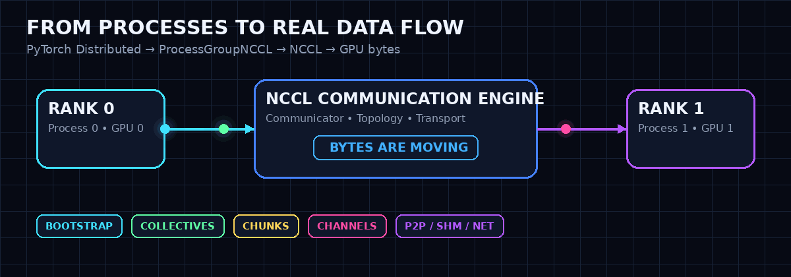
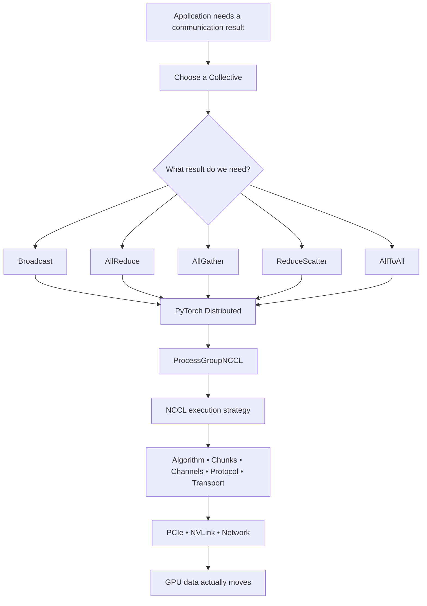
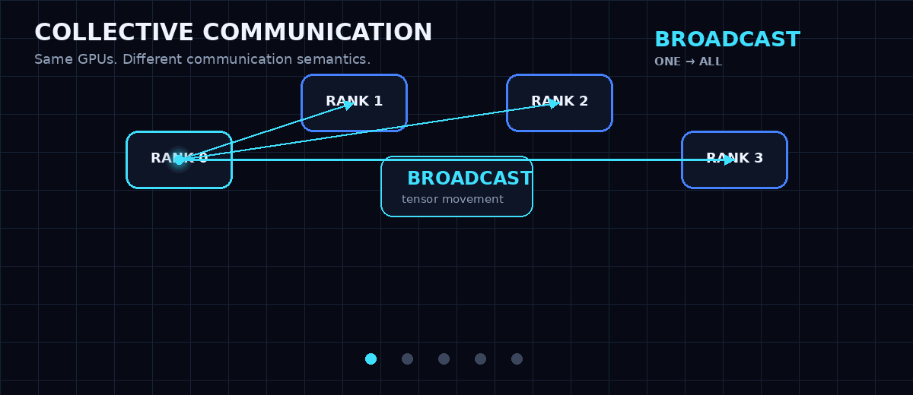
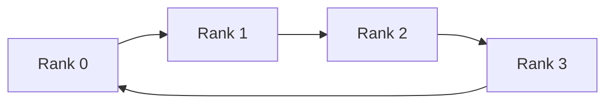
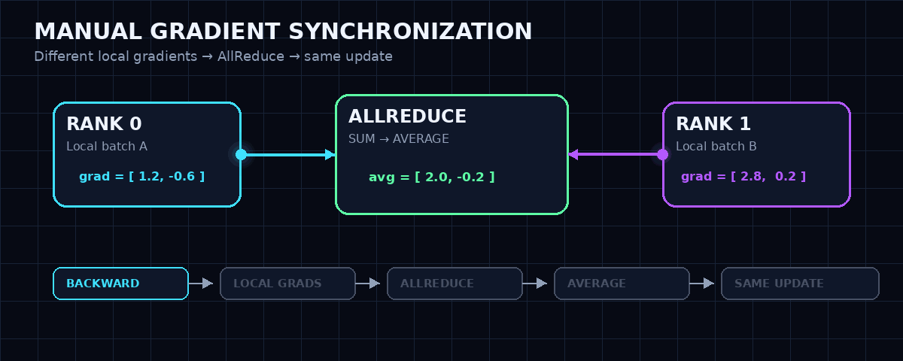
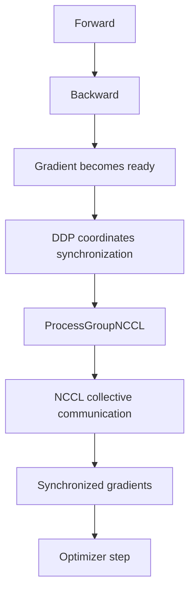

<div align="center">


<br/>


<br/><br/>

[](https://pytorch.org/docs/stable/distributed.html)
[](https://docs.nvidia.com/deeplearning/nccl/)
[](https://developer.nvidia.com/cuda-zone)
[](https://www.python.org/)
[](#)

<br/>

[](https://youtu.be/A3zge7CwO-U)
[](https://youtu.be/2pUNfzrmHrc)

### A coding-first lab for understanding what actually happens when GPUs communicate.

**Not just `dist.all_reduce(tensor)` — but what it means, what every rank owns before and after it, and why distributed training needs it.**

</div>


<p align="center">
  
</p>

---

## Why This Lab Exists

You can write:

```python
dist.all_reduce(tensor)
```

in one line.

But that one line hides the part that matters:

- What did each rank own before the operation?
- What result should each rank own afterward?
- Which ranks must participate?
- What happens when ranks call collectives in the wrong order?
- Why do local gradients differ?
- Why does synchronizing them keep model replicas aligned?
- Where does NCCL fit into the picture?

This repository is designed to make those answers **visible**.

The examples are intentionally small, explicit, and runnable on **2 NVIDIA GPUs** so you can reason about the communication before moving to DDP, FSDP, Tensor Parallelism, MoE, or larger distributed systems.

---

## The Mental Model



> **Collective = what result the group should produce.**  
> **NCCL execution = how that result is moved efficiently across the system.**

That distinction is the backbone of this session.

---

## What You Will Learn

By the end of the lab, you should be able to:

- Explain `Broadcast`, `Reduce`, `AllReduce`, `AllGather`, `ReduceScatter`, and `AllToAll`.
- Predict tensor contents on every rank **before running the code**.
- Launch multi-GPU programs with `torchrun`.
- Understand `RANK`, `LOCAL_RANK`, and `WORLD_SIZE` in the context of communication.
- Explain the **collective contract** and why mismatches can hang a distributed program.
- Use `dist.barrier()` correctly as a synchronization primitive.
- Connect `AllReduce` to **gradient synchronization**.
- Manually synchronize gradients before using DDP.
- Understand why:

```text
AllReduce = ReduceScatter + AllGather
```

is such a useful mental model.
- Understand why **Ring is an algorithm**, not a transport or physical interconnect.

---

## Project Structure

```text
session-04-collective-communication/
│
├── README.md
├── requirements.txt
│
├── notebooks/
│   └── session_04_collective_communication.ipynb
│
├── src/
│   ├── __init__.py
│   ├── distributed_utils.py
│   ├── collectives.py
│   └── gradient_sync.py
│
├── examples/
│   ├── 01_process_identity.py
│   ├── 02_barrier.py
│   ├── 03_broadcast.py
│   ├── 04_reduce.py
│   ├── 05_all_reduce.py
│   ├── 06_all_gather.py
│   ├── 07_reduce_scatter.py
│   ├── 08_all_to_all.py
│   └── 09_manual_gradient_sync.py
│
└── scripts/
    ├── collectives_demo.py
    └── manual_gradient_sync.py
```

### Why it is structured this way

| Directory | Purpose |
|---|---|
| `notebooks/` | Full guided lab with explanations, notes, and experiments |
| `src/` | Shared implementation and distributed utilities |
| `examples/` | One concept per file — ideal while learning |
| `scripts/` | Reusable CLI entry points for complete demos |

The goal is to keep the repository **teachable first, reusable second**.

---

## Recommended Environment

This session is designed around:

```text
Linux
Python 3
PyTorch + CUDA
NCCL
2 NVIDIA GPUs
```

A **Kaggle Notebook with 2× T4 GPUs** works well for the lab.

Check your environment:

```python
import torch

print("PyTorch:", torch.__version__)
print("CUDA available:", torch.cuda.is_available())
print("GPU count:", torch.cuda.device_count())

for i in range(torch.cuda.device_count()):
    print(i, torch.cuda.get_device_name(i))
```

---

## Quick Start

Clone the repository and move into the session directory:

```bash
git clone <YOUR_REPOSITORY_URL>
cd session-04-collective-communication
```

Run a simple identity check:

```bash
torchrun \
  --standalone \
  --nproc_per_node=2 \
  examples/01_process_identity.py
```

Expected mental model:

```text
Process 0 → Rank 0 → Local Rank 0 → GPU 0
Process 1 → Rank 1 → Local Rank 1 → GPU 1

WORLD_SIZE = 2
```

---


<p align="center">
  
</p>


# The Experiments

## 01 — Process Identity

Before communicating, every process needs a distributed identity.

```bash
torchrun \
  --standalone \
  --nproc_per_node=2 \
  examples/01_process_identity.py
```

You should be able to answer:

```text
Who am I?
Which GPU am I using?
How many ranks are participating?
```

---

## 02 — Barrier

A barrier is a synchronization point.

```text
Rank 0 ─────────┐
                ├── BARRIER ───→ continue
Rank 1 ─────────┘
```

Run:

```bash
torchrun \
  --standalone \
  --nproc_per_node=2 \
  examples/02_barrier.py
```

In the demo, one rank is intentionally delayed.

The faster rank reaches the barrier first — but cannot continue until the other rank arrives.

> `barrier()` synchronizes execution. It does **not** produce a tensor result.

---

## 03 — Broadcast

One rank owns the data. Everyone receives it.

### Before

```text
Rank 0 → [10, 20]
Rank 1 → [ 0,  0]
```

### After

```text
Rank 0 → [10, 20]
Rank 1 → [10, 20]
```

Run:

```bash
torchrun \
  --standalone \
  --nproc_per_node=2 \
  examples/03_broadcast.py
```

```python
dist.broadcast(tensor, src=0)
```

> `src=0` means **Rank 0**, not a physical GPU ID.

---

## 04 — Reduce

Everyone contributes. One destination receives the reduced result.

```text
Rank 0 → [1, 2] ──┐
                   ├── SUM ──→ Rank 0 → [4, 6]
Rank 1 → [3, 4] ──┘
```

Run:

```bash
torchrun \
  --standalone \
  --nproc_per_node=2 \
  examples/04_reduce.py
```

```python
dist.reduce(
    tensor,
    dst=0,
    op=dist.ReduceOp.SUM,
)
```

---

## 05 — AllReduce

Everyone contributes.

Everyone receives the reduced result.

### Before

```text
Rank 0 → [1, 2]
Rank 1 → [3, 4]
```

### After

```text
Rank 0 → [4, 6]
Rank 1 → [4, 6]
```

Run:

```bash
torchrun \
  --standalone \
  --nproc_per_node=2 \
  examples/05_all_reduce.py
```

```python
dist.all_reduce(
    tensor,
    op=dist.ReduceOp.SUM,
)
```

### Reduce vs AllReduce

| Operation | Contributors | Who gets the final reduced result? |
|---|---:|---|
| `Reduce` | All ranks | One destination rank |
| `AllReduce` | All ranks | Every rank |

This distinction becomes critical when we reach gradient synchronization.

---

## 06 — AllGather

Every rank contributes one piece.

Every rank receives **all pieces**.

### Before

```text
Rank 0 → [10]
Rank 1 → [20]
```

### After

```text
Rank 0 → [[10], [20]]
Rank 1 → [[10], [20]]
```

Run:

```bash
torchrun \
  --standalone \
  --nproc_per_node=2 \
  examples/06_all_gather.py
```

### Do not confuse it with AllReduce

```text
AllGather:
[10] + [20] → [[10], [20]]

AllReduce SUM:
[10] + [20] → [30]
```

**AllGather collects. AllReduce combines.**

---

## 07 — ReduceScatter

Reduce first.

Then split the reduced result across the ranks.

### Inputs

```text
Rank 0 → [ 1,  2,  3,  4]
Rank 1 → [10, 20, 30, 40]
```

### Conceptual reduction

```text
[11, 22, 33, 44]
```

### Final ownership

```text
Rank 0 → [11, 22]
Rank 1 → [33, 44]
```

Run:

```bash
torchrun \
  --standalone \
  --nproc_per_node=2 \
  examples/07_reduce_scatter.py
```

This operation becomes extremely important when understanding Ring AllReduce and modern sharded training systems.

---

## 08 — AllToAll

Every rank sends different pieces to different destinations.

```text
            To Rank 0    To Rank 1

From R0        10           11
From R1        20           21
```

After the exchange:

```text
Rank 0 → [10, 20]
Rank 1 → [11, 21]
```

Run:

```bash
torchrun \
  --standalone \
  --nproc_per_node=2 \
  examples/08_all_to_all.py
```

This communication pattern becomes especially important in systems such as:

- Mixture-of-Experts
- Expert Parallelism
- Tensor/data redistribution

---

# The Collective Contract

This rule matters more than any individual API call.

> **Collectives are group operations.**

The participating ranks must execute a compatible communication sequence.

This is valid:

```text
Rank 0: all_reduce(...)
Rank 1: all_reduce(...)
```

This is not:

```text
Rank 0: all_reduce(...)
Rank 1: broadcast(...)
```

And this is dangerous too:

```text
Rank 0 enters all_reduce(...)
Rank 1 never reaches it
```

The result can be a hang, timeout, or another distributed failure.

When debugging distributed code, do not ask only:

> "Is Rank 0's code correct?"

Ask:

> **"Is the global communication schedule correct across all ranks?"**

---

# Ring AllReduce

Once you understand what AllReduce means, the next question becomes:

> **How can we execute it efficiently?**

A powerful mental model is:

```text
AllReduce
   =
ReduceScatter
   +
AllGather
```

For a ring of four ranks:

```text
R0 → R1 → R2 → R3 → R0
```

we can split tensors into chunks and move different chunks concurrently around the ring.



The first phase produces distributed reduced chunks:

```text
ReduceScatter
      ↓
R0 owns one reduced chunk
R1 owns one reduced chunk
R2 owns one reduced chunk
R3 owns one reduced chunk
```

The second phase distributes those completed chunks:

```text
AllGather
      ↓
Every rank receives every reduced chunk
```

### Important

**Ring is an algorithm / communication plan.**

It is not:

- PCIe
- NVLink
- InfiniBand
- NCCL P2P transport

Those belong to different layers of the communication stack.

---


<p align="center">
  
</p>


# 09 — Manual Gradient Synchronization

This is where the collectives stop being abstract.

Every rank has the same model but receives a different local batch:

```text
                 Same Model
                /          \
               /            \
        Rank 0               Rank 1
        Batch A              Batch B
           ↓                    ↓
        Forward              Forward
           ↓                    ↓
        Backward             Backward
           ↓                    ↓
     Local Gradient       Local Gradient
```

Because the data differs:

```text
Gradient on Rank 0 ≠ Gradient on Rank 1
```

If each rank updates immediately, the replicas can diverge.

So we synchronize:

```text
Local Gradients
      ↓
AllReduce SUM
      ↓
Divide by WORLD_SIZE
      ↓
Same Averaged Gradient
      ↓
optimizer.step()
      ↓
Same Updated Weights
```

Run:

```bash
torchrun \
  --standalone \
  --nproc_per_node=2 \
  examples/09_manual_gradient_sync.py
```

At the heart of the demo:

```python
dist.all_reduce(
    parameter.grad,
    op=dist.ReduceOp.SUM,
)

parameter.grad.div_(world_size)
```

That small piece of code creates the bridge to **DistributedDataParallel**.

> The simple division by `WORLD_SIZE` in this teaching example assumes equal local batch sizes.

---

# From Manual Sync to DDP

After this lab, the following should no longer look like magic:

```python
from torch.nn.parallel import DistributedDataParallel as DDP

model = DDP(
    model,
    device_ids=[local_rank],
)
```

A simplified mental model:



Real DDP is more sophisticated than one Python `all_reduce()` per parameter.

It introduces concepts such as:

- gradient buckets
- communication/computation overlap
- reducer internals
- synchronization scheduling

Those are intentionally left for the next layer of the series.

---

## Unified Demo CLI

Instead of running individual example files, you can use one entry point:

```bash
torchrun \
  --standalone \
  --nproc_per_node=2 \
  scripts/collectives_demo.py \
  --demo all_reduce
```

Available demos:

```text
identity
barrier
broadcast
reduce
all_reduce
all_gather
reduce_scatter
all_to_all
```

Manual gradient synchronization has its own script:

```bash
torchrun \
  --standalone \
  --nproc_per_node=2 \
  scripts/manual_gradient_sync.py
```

---

## What Is Intentionally Not Covered Yet?

This lab is focused on building the correct communication mental model.

The following topics are intentionally deferred:

<details>
<summary><strong>Click to expand</strong></summary>

<br/>

- `Gather` / `Scatter` deep dive
- `async_op=True`
- custom process groups
- subgroup communication
- CUDA stream semantics
- communication/computation overlap
- latency vs bandwidth benchmarking
- `nccl-tests`
- advanced NCCL algorithm selection
- custom Ring AllReduce implementation
- DDP reducer internals
- FSDP communication patterns
- Tensor Parallel communication
- Expert Parallel / MoE routing

</details>

---

## Common Mistakes

### `src=0` means Rank 0 — not GPU 0

Do not mix these namespaces:

```text
Global Rank
Local Rank
CUDA Device Index
NCCL Communicator Rank
OS Process ID
```

They may have the same number in a simple two-GPU experiment, but they represent different concepts.

### Different collective order across ranks

```text
Rank 0:
all_reduce()
broadcast()

Rank 1:
broadcast()
all_reduce()
```

This can break the communication schedule.

### One rank crashes before the collective

The surviving rank may appear "stuck" because it is waiting for a participant that will never arrive.

### Too many barriers

Barriers are excellent for teaching and debugging.

They are not free synchronization.

Do not use the rank-ordered printing pattern in performance-sensitive code.

---

## Session Checklist

Before moving on, make sure you can answer all of these:

- [ ] What is the difference between Reduce and AllReduce?
- [ ] What is the difference between AllGather and AllReduce?
- [ ] What does ReduceScatter produce?
- [ ] What does AllToAll route?
- [ ] What does a barrier guarantee?
- [ ] Why must collective order match across ranks?
- [ ] Why can local gradients differ between ranks?
- [ ] Why does gradient synchronization keep model replicas aligned?
- [ ] Why is `AllReduce = ReduceScatter + AllGather` useful?
- [ ] Why is Ring an algorithm rather than a transport?
- [ ] Where does NCCL sit between PyTorch and the physical hardware?

If these are clear, you are ready to study **DDP internals without treating DDP as a black box**.

---

## Watch the Distributed AI Systems Series

<div align="center">

### Learn the stack from the system level — not just from the framework API.

<br/>

<a href="https://youtu.be/A3zge7CwO-U">
  
</a>

<br/><br/>

<a href="https://youtu.be/2pUNfzrmHrc">
  
</a>

<br/><br/>

**Session 3:** NCCL, Bootstrap, Communicators, Topology, Transports, Chunks & Channels  
**Session 4:** Collective Communication — this repository

<br/>

> New sessions keep building on the same mental model, layer by layer.

</div>

---

## References

- [PyTorch Distributed](https://pytorch.org/docs/stable/distributed.html)
- [DistributedDataParallel](https://pytorch.org/docs/stable/generated/torch.nn.parallel.DistributedDataParallel.html)
- [NVIDIA NCCL Documentation](https://docs.nvidia.com/deeplearning/nccl/)

---

<div align="center">


<br/>

### If this repository helped you understand distributed AI, consider starring it and sharing the series.

**Build the system. Understand the communication. Remove the black box.**

</div>


